# Last.fm Charts, Data Pipeline

> **Projeto de modernização de um pipeline de dados musical.**
> O projeto original era um script monolítico local que gerava rankings semanais de músicas entre um grupo de amigos via Last.fm. Este repositório representa a evolução: uma arquitetura de dados em camadas (Medallion), com ingestão estruturada, transformações documentadas, validação de qualidade e persistência em banco de dados relacional, tudo containerizado.


---


## Contexto

O projeto nasceu como uma automação pessoal em 2022: toda semana, um script era executado manualmente para coletar os scrobbles (as músicas escutadas) do grupo via API do Last.fm e gerava um ranking de artistas, músicas e usuários em um arquivo Excel formatado, que era compartilhado no grupo.

Funcionava, mas era frágil. Tudo rodava localmente em uma única máquina, sem separação de responsabilidades, sem versionamento de dados, sem documentação e com dependências desatualizadas. Qualquer mudança pequena quebrava o fluxo inteiro.

**Este projeto reescreve essa base do zero**, aplicando conceitos modernos de engenharia de dados:

| | Projeto Anterior | Projeto Atual |
|---|---|---|
| Estrutura | Script monolítico único | 3 camadas independentes (Bronze → Silver → Gold) |
| Armazenamento | Arquivos Excel locais | JSON/CSV (Bronze) + Parquet (Silver) + PostgreSQL (Gold) |
| Coleta de dados | `pylast` (wrapper) | `requests` direto com paginação e retry |
| Resiliência | | Checkpoint por usuário, retoma de onde parou |
| Dependências | `pylast`, `openpyxl` desatualizados | Stack moderna: `pandas 2.x`, `sqlalchemy 2.x`, `pyarrow` |
| Credenciais | Armazenadas no script | Variáveis de ambiente via `.env` |
| Modelagem Gold | | dbt com Star Schema, macro MD5, testes e documentação |
| Documentação | | README, dicionário de dados, relatório de qualidade automático |
| Portabilidade | Máquina da autora | Docker (3 containers orquestrados) |
| Qualidade de dados | | Great Expectations com 13 expectations + Data Docs + dbt |
| Visualização | Rankings em Excel | Dashboard interativo no Grafana |
| Tipagem de datas | `Day` e `Time` como strings brutas | 10 colunas de tempo extraídas corretamente |
| Tratamento de erros | | Retry automático para erros 5xx da API |


---


## Observações Acadêmicas

**Sobre o volume de dados:**
A API do Last.fm limita a coleta a **200 scrobbles por requisição**. Para atingir o requisito de 1 milhão de linhas, foi necessário coletar o histórico completo de cada usuário, paginando requisição por requisição com um intervalo de 0.1s entre cada chamada para respeitar o rate limit da API. O processo completo levou **algumas horas** de execução contínua, com um sistema de checkpoint implementado para retomar a coleta em caso de interrupção.

**Sobre a camada Gold:**
No Lab01, a Gold era implementada via `gold.py` com pandas + SQLAlchemy. Neste laboratório, esse script foi substituído por um projeto dbt completo. O `gold.py` foi mantido no repositório para referência histórica e como fallback, mas **não é mais executado no pipeline principal**.


---


## Arquitetura

```
Last.fm API
    │
    ▼
┌─────────────┐
│   BRONZE    │  Ingestão raw, dados exatamente como a API retorna
│data/bronze/ │  JSON por usuário + CSV consolidado
└──────┬──────┘
       │
       ▼
┌─────────────┐
│  VALIDATE   │  Great Expectations valida o bronze.csv
│  data/gx/   │  13 expectations + Data Docs (HTML)
└──────┬──────┘
       │
       ▼
┌─────────────┐
│   SILVER    │  Limpeza e padronização
│data/silver/ │  Parquet + relatório de qualidade (.md) + carga no PostgreSQL (schema silver)
└──────┬──────┘
       │
       ▼
┌─────────────┐
│    GOLD     │  dbt Star Schema no PostgreSQL (schema public)
│  lastfm_dbt │  staging view + 5 dimensões + tabela fato
│             │  macro MD5 + testes genéricos + teste singular
└──────┬──────┘
       │
       ▼
┌─────────────┐
│   GRAFANA   │  Dashboard interativo
│ localhost:  │  6 painéis com filtros de período e usuário
│    3001     │
└─────────────┘
```


---


## Estrutura do Repositório

```
lastfm-charts/
├── data/
│   ├── bronze/
│   │   ├── bronze.csv                         # CSV consolidado
│   │   ├── {usuario}_bronze.json              # JSONs por usuário
│   │   └── checkpoint.json                    # Checkpoint para retomada em caso de erro
│   ├── silver/
│   │   ├── silver.parquet                     # Dado limpo
│   │   ├── silver_report.md                   # Relatório de qualidade automático
│   │   └── graphs/                            # Gráficos gerados pela Silver
│   └── gx/
│       └── uncommitted/
│           └── data_docs/                     # Relatório HTML do Great Expectations (não versionado)
├── docs/
│   └── images/                                # Prints e imagens do README
├── lastfm_dbt/
│   ├── macros/
│   │   └── gerar_chave_surrogate.sql          # macro MD5 customizada
│   ├── models/
│   │   ├── stg_scrobbles.sql                  # view com casting e filtros
│   │   ├── staging/
│   │   │   ├── sources.yml
│   │   │   ├── staging.yml
│   │   └── marts/
│   │       ├── marts.yml
│   │       ├── dim_album.sql
│   │       ├── dim_artista.sql
│   │       ├── dim_faixa.sql
│   │       ├── dim_tempo.sql
│   │       ├── dim_usuario.sql
│   │       └── fact_scrobbles.sql
│   ├── tests/
│   │   └── assert_sem_scrobbles_futuros.sql   # singular
│   ├── dbt_project.yml
│   ├── profiles.yml                           # Credenciais dbt (não versionado)
│   └── profiles.yml.example
├── src/
│   ├── bronze.py                              # Camada Bronze
│   ├── bronze_validate.py                     # Validação com Great Expectations
│   ├── silver.py                              # Camada Silver
│   └── gold.py                                # Mantido como referência histórica
├── .dockerignore                              # Exclui arquivos desnecessários da imagem Docker
├── .env                                       # Credenciais (não versionado)
├── .env.example
├── .gitignore
├── docker-compose.yml
├── Dockerfile
├── pyproject.toml
└── README.md
```


---


## Infraestrutura Docker

O projeto sobe 3 containers orquestrados via `docker-compose.yml`:

| Container | Imagem | Descrição | Porta |
|---|---|---|---|
| `lastfm_postgres` | `postgres:15` | Banco de dados relacional | `5432` |
| `lastfm_app` | imagem customizada | Pipeline Python (Bronze → Silver) + dbt (Gold) | |
| `lastfm_grafana` | `grafana/grafana:latest` | Dashboard BI | `3001` |

Os containers `app` e `grafana` se comunicam com o `postgres` via rede interna Docker (`lastfm_postgres` como hostname), sem expor credenciais.

### 1. Como construir a imagem Docker

```bash
docker compose build
```

### 2. Como subir os containers

```bash
docker compose up -d
```

Para subir e rebuildar ao mesmo tempo:

```bash
docker compose up -d --build
```

Verificar se os containers estão rodando:

```bash
docker ps
```

### Parar os containers

```bash
docker compose down        # para e remove containers, mantém volumes
docker compose down -v     # para, remove containers E volumes (apaga dados do banco e do Grafana)
```


---


## Instruções de Execução

### Pré-requisitos

- Python 3.11+
- Docker Desktop
- Conta e API Key no [Last.fm](https://www.last.fm/api)

### 1. Clone o repositório

```bash
git clone https://github.com/isacomelli/lastfm-charts.git
cd lastfm-charts
```

### 2. Configure o `.env`

```bash
# edite o .env com suas credenciais
cp .env.example .env
```

```env
LASTFM_API_KEY=sua_chave
LASTFM_API_SECRET=seu_secret
POSTGRES_USER=root
POSTGRES_PASSWORD=sua_senha
POSTGRES_DB=lastfm_charts
POSTGRES_HOST=localhost
POSTGRES_PORT=5432
GRAFANA_USER=admin
GRAFANA_PASSWORD=sua_senha
```

### 3. Configure o `profiles.yml`

```bash
# edite o profiles.yml com suas credenciais
lastfm_dbt/profiles.yml.example lastfm_dbt/profiles.yml
```

```profiles.yml
lastfm_dbt:
  target: dev
  outputs:
    dev:
      type: postgres
      host: localhost
      port: 5432
      dbname: lastfm_charts
      user: root
      password: sua_senha
      schema: public
      threads: 4
```

### 4. Instale as dependências
```bash
python -m venv .venv
.venv\Scripts\activate        # Windows

pip install .
```

> As dependências estão declaradas em `pyproject.toml`.

### 5. Suba os containers Docker

```bash
docker compose up -d --build
```

### 6. Execute o pipeline em ordem

```bash
# Bronze roda local (coleta da API, não depende do banco)
python src/bronze.py

# Entrar no container para o restante
docker exec -it lastfm_app bash

# Validação Bronze e rodar Silver 
python src/bronze_validate.py
python src/silver.py

# Rodar Gold via dbt
cd lastfm_dbt
dbt run --full-refresh
dbt test
dbt docs generate

# Verificar online resultados do dbt
dbt docs serve
```

> A Bronze salva um checkpoint em `data/bronze/checkpoint.json`. Se a execução for interrompida, rode novamente, ela retoma de onde parou.


---


## Documentação das Etapas

### Subindo a aplicação com Docker

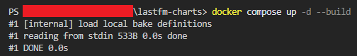

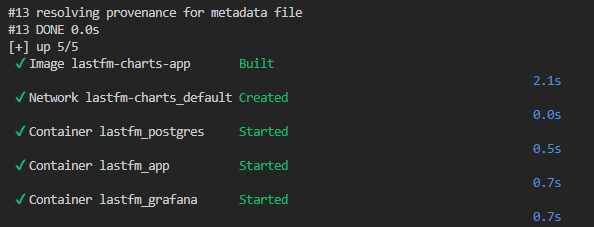

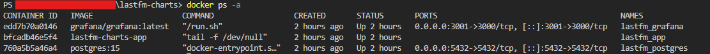

### Etapa Bronze

A Bronze coleta os scrobbles de cada usuário via API do Last.fm e salva os dados sem alteração, exatamente como a API retorna. Cada usuário gera um JSON individual, e ao final todos são consolidados em um CSV.

**Extração incremental de usuários existentes**

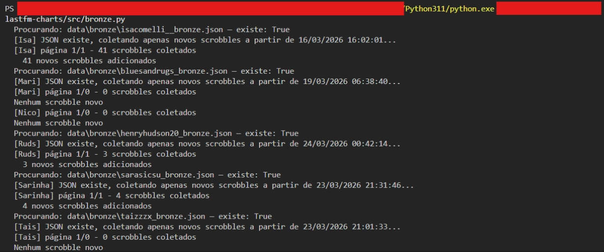

**Ingestão de novo usuário**

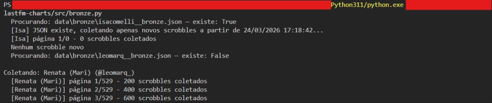

**Retomada de execução via checkpoint**

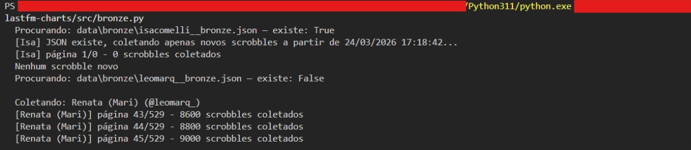

**Consolidação dos dados JSON no CSV**


### Etapa de Validação (Great Expectations)

A validação roda após a Bronze e antes da Silver, garantindo que nenhum dado corrompido avance no pipeline.

O relatório HTML (Data Docs) é gerado em:
```
data/gx/uncommitted/data_docs/local_site/index.html
```

Abra o arquivo no browser para visualizar o relatório completo de validação.

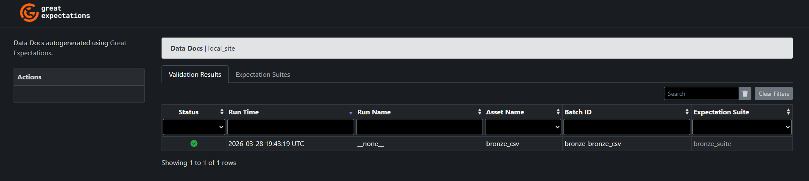

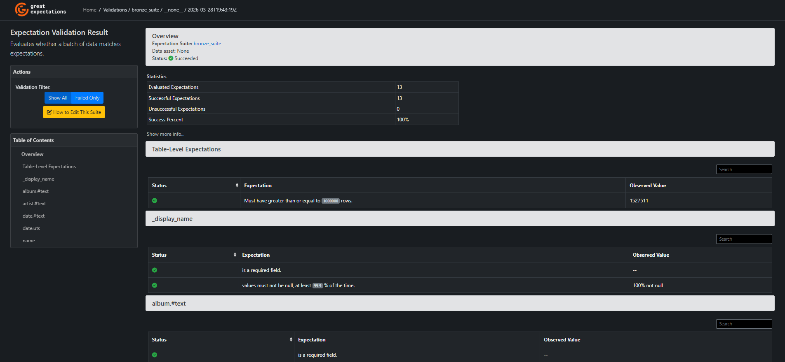

#### Expectations implementadas

| # | Expectation | Coluna Bronze | Coluna Silver (após rename) | Descrição |
|---|---|---|---|---|
| 1 | `expect_column_to_exist` | `name` | `track_name` | Coluna essencial existe |
| 2 | `expect_column_to_exist` | `artist.#text` | `artist_name` | Coluna essencial existe |
| 3 | `expect_column_to_exist` | `album.#text` | `album_name` | Coluna essencial existe |
| 4 | `expect_column_to_exist` | `date.uts` | `timestamp_unix` | Coluna essencial existe |
| 5 | `expect_column_to_exist` | `_display_name` | `username` | Coluna essencial existe |
| 6 | `expect_column_values_to_not_be_null` | `date.uts` | `timestamp_unix` | Scrobbles sem timestamp são descartados na Silver |
| 7 | `expect_column_values_to_not_be_null` | `_display_name` | `username` | Scrobbles sem usuário são descartados na Silver |
| 8 | `expect_column_values_to_match_regex` | `date.uts` | `timestamp_unix` | Timestamp deve ser numérico |
| 9 | `expect_column_values_to_match_regex` | `date.#text` | `datetime_raw` | Formato da API: `DD Mon YYYY, HH:MM` |
| 10 | `expect_column_values_to_be_between` | `date.uts` | `timestamp_unix` | Intervalo válido: 2004 → hoje |
| 11 | `expect_column_values_to_not_be_null` | `name` | `track_name` | Campo obrigatório da API; nulos indicariam dado corrompido na coleta |
| 12 | `expect_column_values_to_not_be_null` | `artist.#text` | `artist_name` | Campo obrigatório da API; nulos indicariam dado corrompido na coleta |
| 13 | `expect_table_row_count_to_be_between` | | | Mínimo de 1 milhão de linhas |

### Etapa Silver

A camada Silver consome os dados da Bronze, aplica transformações, persiste os dados em formato Parquet e no PostgreSQL (schema `silver`).
Além disso, gera automaticamente um relatório de qualidade com estatísticas descritivas e visualizações.


[](docs/images/silver_report_exemplo.md)

### Etapa Gold Antiga

Lê o Parquet da Silver, cria o Star Schema no PostgreSQL, carrega todas as dimensões, a tabela fato e as métricas de negócio.


#### Métricas de Negócio

As 5 queries implementadas em `gold.py` respondem às seguintes perguntas:

1. **Ranking geral de artistas**, quais artistas têm mais scrobbles somados no grupo?

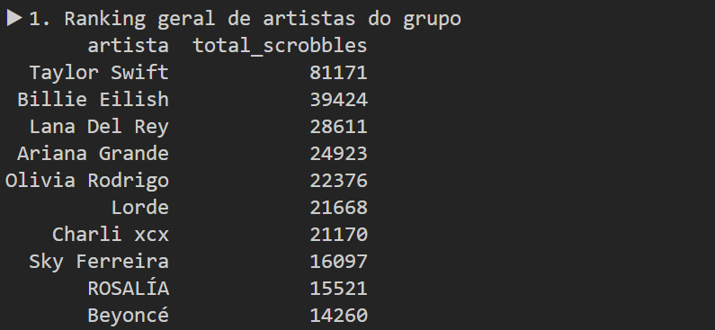

2. **Quem mais escutou**, ranking dos usuários por total de scrobbles


3. **Artista favorito por usuário**, artista mais escutado individualmente por cada membro


4. **Hora do dia com mais scrobbles**, em qual horário o grupo mais escuta música?


5. **Top 10 faixas**, as músicas mais tocadas no histórico completo do grupo


### Etapa Gold Nova

É implementada com dbt. O projeto lê a `silver.scrobbles` via source, aplica transformações na staging e cria o Star Schema nos marts.

#### Macro `gerar_chave_surrogate`

Macro customizada que gera chaves surrogate via MD5, aceitando uma ou mais colunas:

```sql
{{ gerar_chave_surrogate('coluna_a') }}
{{ gerar_chave_surrogate('coluna_a', 'coluna_b') }}
```

#### Testes implementados

**Testes genéricos** (definidos nos YAMLs): `unique` e `not_null` em todas as PKs, `not_null` e `relationships` (integridade referencial) nas FKs da `fact_scrobbles` e nas dimensões.

**Teste singular** (`assert_sem_scrobbles_futuros.sql`): garante que nenhum scrobble tenha `id_tempo` no futuro. Se a query retornar linhas, o teste falha.

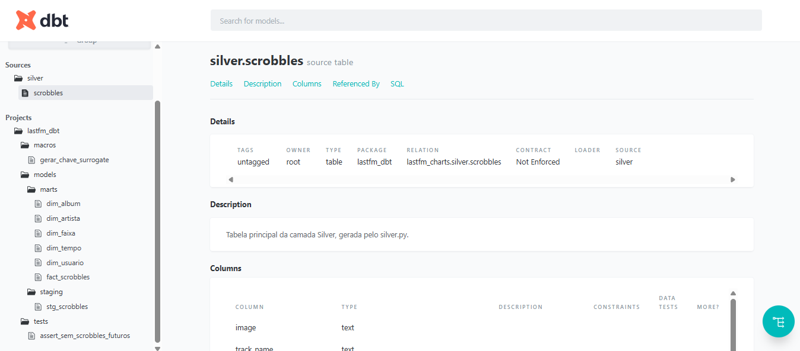

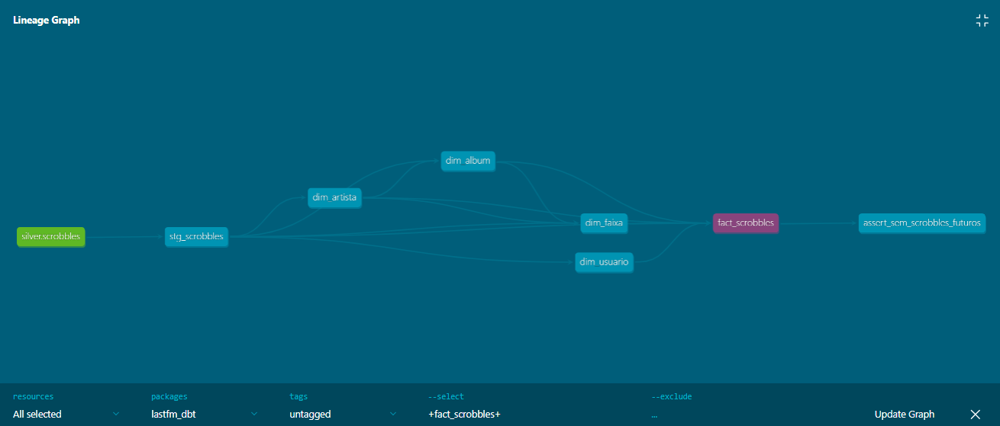

### PostgreSQL

Os dados do PostgreSQL podem ser visualizados através do DBeaver:


### Dashboard Grafana

O Grafana está disponível em `http://localhost:3001` após subir os containers. Login com as credenciais definidas no `.env` (`GRAFANA_USER` / `GRAFANA_PASSWORD`).

#### Painéis

| # | Painel | Tipo | Descrição |
|---|---|---|---|
| 1 | Evolução de Scrobbles | Time series | Scrobbles ao longo do tempo (fuso BRT) |
| 2 | Scrobbles por Usuário | Table + Bar gauge | Scrobbles + variação vs período anterior |
| 3 | Top 10 Artistas | Bar chart horizontal | Artistas mais ouvidos no período |
| 4 | Top 10 Faixas | Table | Faixas mais ouvidas no período |
| 5 | Scrobbles por Hora do Dia | Bar chart vertical | Distribuição por hora (fuso BRT) |
| 6 | Top 10 Álbuns | Table | Álbuns mais ouvidos no período |

Todos os painéis respondem a dois filtros no topo do dashboard:
- **Time Range**: período de tempo (últimos 7 dias, último mês, intervalo customizado, etc.)
- **Usuario**: dropdown com seleção múltipla de usuários do grupo

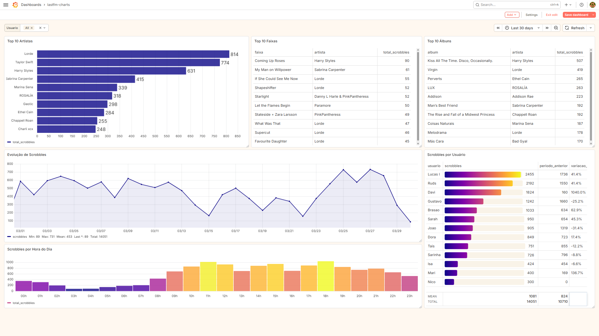

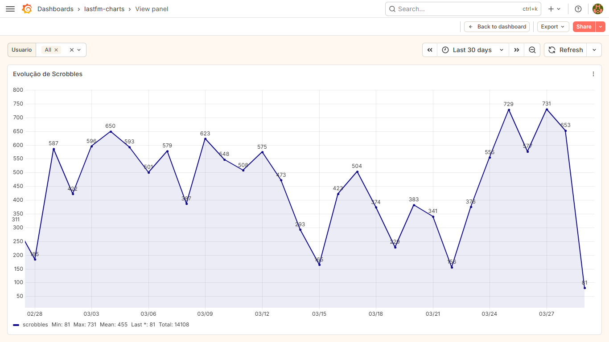

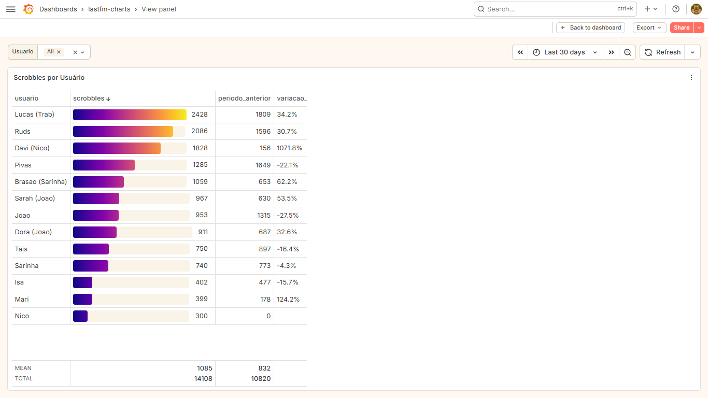

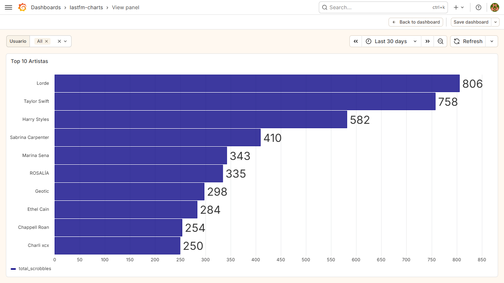

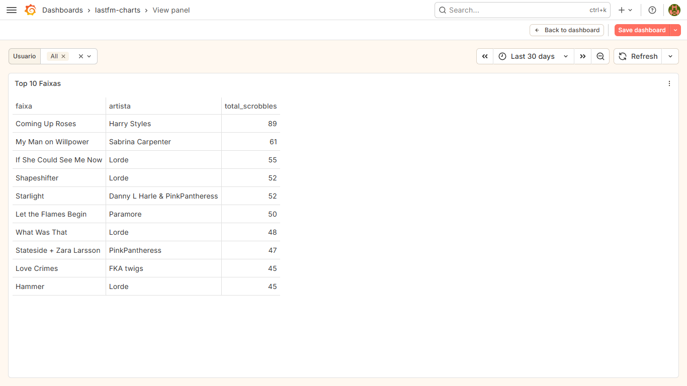

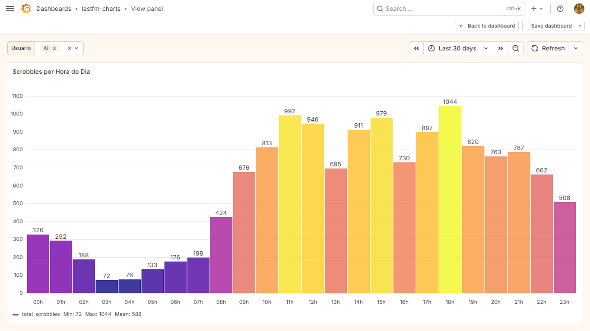

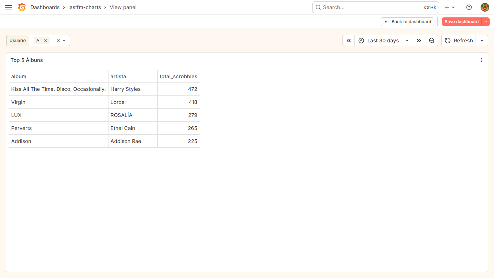


---


## Dicionário de Dados

### Bronze (`data/bronze/bronze.csv`)
Campos brutos retornados pela API do Last.fm, sem alteração.

| Coluna | Tipo | Descrição |
|---|---|---|
| `name` | string | Nome da música |
| `artist.#text` | string | Nome do artista |
| `album.#text` | string | Nome do álbum |
| `date.uts` | string | Timestamp Unix do scrobble |
| `date.#text` | string | Data/hora legível retornada pela API |
| `_display_name` | string | Nome de exibição do usuário no grupo (adicionado na coleta) |
| `mbid` | string | MusicBrainz ID da faixa |
| `url` | string | URL da faixa no Last.fm |
| `image` | array | URLs das imagens do álbum |
| `streamable` | string | Flag de streamable da API |

### Silver (`data/silver/silver.parquet` + `silver.scrobbles`)
Dado limpo, padronizado e enriquecido.

| Coluna | Tipo | Descrição |
|---|---|---|
| `username` | string | Nome de exibição do usuário |
| `track_name` | string | Nome da faixa (padronizado) |
| `artist_name` | string | Nome do artista (padronizado) |
| `album_name` | string | Nome do álbum (padronizado) |
| `title` | string | `track_name - artist_name` (legado) |
| `timestamp_unix` | int64 | Timestamp Unix do scrobble |
| `datetime_utc` | datetime | Data e hora em UTC |
| `year` | int | Ano do scrobble |
| `month` | int | Mês do scrobble (1–12) |
| `month_name` | string | Nome do mês (January, February...) |
| `day` | int | Dia do mês |
| `hour` | int | Hora do dia (0–23) em UTC |
| `weekday` | int | Dia da semana (0=Monday) |
| `weekday_name` | string | Nome do dia (Monday, Tuesday...) |
| `week_of_year` | int | Semana do ano (1–53) |
| `quarter` | int | Trimestre (1–4) |
| `semester` | int | Semestre (1–2) |

### Gold (PostgreSQL - gerado pelo dbt)

**`dim_usuario`** - usuários do grupo
| Coluna | Tipo | Descrição |
|---|---|---|
| `id_usuario` | varchar (MD5) PK | Chave surrogate |
| `username` | varchar | Nome de exibição do usuário |

**`dim_artista`** - artistas encontrados nos scrobbles
| Coluna | Tipo | Descrição |
|---|---|---|
| `id_artista` | varchar (MD5) PK | Chave surrogate |
| `artist_name` | varchar | Nome do artista |

**`dim_album`** - álbuns (chave natural: `album_name + id_artista`)
| Coluna | Tipo | Descrição |
|---|---|---|
| `id_album` | varchar (MD5) PK | Chave surrogate |
| `album_name` | varchar | Nome do álbum |
| `id_artista` | varchar (MD5) FK | Referência ao artista |

**`dim_faixa`** - faixas musicais (chave natural: `track_name + id_artista`)
| Coluna | Tipo | Descrição |
|---|---|---|
| `id_faixa` | varchar (MD5) PK | Chave surrogate |
| `track_name` | varchar | Nome da faixa |
| `title` | varchar | `track_name - artist_name` |
| `id_artista` | varchar FK | Referência ao artista |
| `id_album` | varchar FK | Referência ao álbum |

**`dim_tempo`** - dimensão de tempo com granularidade por hora
| Coluna | Tipo | Descrição |
|---|---|---|
| `id_tempo` | bigint PK | Timestamp Unix |
| `datetime_utc` | timestamptz | Data e hora em UTC |
| `ano` | smallint | Ano |
| `mes` | smallint | Mês |
| `nome_mes` | varchar | Nome do mês |
| `dia` | smallint | Dia |
| `hora` | smallint | Hora (UTC) |
| `dia_semana` | smallint | Dia da semana |
| `nome_dia` | varchar | Nome do dia |
| `semana_ano` | smallint | Semana do ano |
| `trimestre` | smallint | Trimestre |
| `semestre` | smallint | Semestre |

**`fact_scrobbles`** - tabela fato, granularidade: 1 linha por scrobble
| Coluna | Tipo | Descrição |
|---|---|---|
| `id_scrobble` | varchar (MD5) PK | Chave surrogate |
| `id_usuario` | varchar FK | Referência ao usuário |
| `id_faixa` | varchar FK | Referência à faixa |
| `id_artista` | varchar FK | Referência ao artista |
| `id_album` | varchar FK | Referência ao álbum |
| `id_tempo` | bigint FK | Referência ao timestamp |
| `scrobbles` | smallint | Quantidade (sempre 1 por evento) |


---


## Qualidade de Dados

O relatório completo é gerado automaticamente em `data/silver/silver_report.md` ao rodar a Silver. Problemas identificados durante o desenvolvimento:

| Problema | Coluna | Impacto | Tratamento |
|---|---|---|---|
| Faixas sem timestamp | `date.uts` | Não podem ser posicionadas no tempo | Removidas |
| Nome de álbum ausente | `album_name` | ~0.8% dos scrobbles sem álbum | Preenchido com `"Unknown"` no dbt (`COALESCE`) |
| Faixas `nowplaying` sem data | `@attr.nowplaying` | Retornadas pela API sem timestamp | Filtradas na Bronze |
| Nomes de colunas inconsistentes | múltiplas | Dificulta joins | Padronizados para `snake_case` |
| Duplicatas por retry | `timestamp_unix + username` | Contagem inflada | Removidas na Silver + `ROW_NUMBER()` na `fact_scrobbles` |
| Mesma faixa com álbuns diferentes | `track_name + album_name` | Chave duplicada na `dim_faixa` | `MIN(album_name)` garante unicidade |
| Scrobbles com timestamp no futuro | `id_tempo` | Dado inválido na fato | Detectado pelo teste singular do dbt (`assert_sem_scrobbles_futuros`) |


---


## Stack

| Tecnologia | Uso |
|---|---|
| Python 3.11 | Linguagem principal |
| pandas 2.x | Manipulação de dados |
| requests | Coleta via API REST |
| pyarrow | Leitura/escrita Parquet |
| SQLAlchemy 2.x | Conexão com PostgreSQL |
| psycopg2 | Driver PostgreSQL |
| matplotlib | Geração de gráficos |
| python-dotenv | Gerenciamento de credenciais |
| Great Expectations 1.x | Validação e qualidade de dados |
| dbt | Modelagem e transformação da camada Gold |
| PostgreSQL 15 | Banco de dados relacional |
| Docker | Containerização |
| Grafana | Dashboard BI |
| DBeaver | Interface de gerenciamento do banco |


---


## Observações

- Os dados coletados pertencem aos usuários e são usados exclusivamente para fins educacionais
- Nunca versione o arquivo `.env`, `profiles.yml` e os arquivos em `data/`
- Os arquivos em `data/` não são versionados por questão de tamanho. Rode `bronze.py` para coletar os dados (o checkpoint garante que a coleta pode ser retomada em caso de interrupção)
- Os horários no Grafana são exibidos no fuso `America/Sao_Paulo` (BRT, UTC-3)
- O `gold.py` foi mantido no repositório como referência histórica do Lab01, mas não faz parte do pipeline ativo
